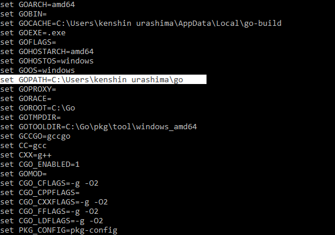
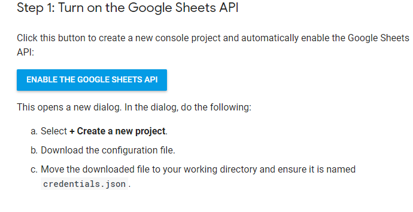

# **Progracademy-Whatsapp**

## Instalación y configuración de Golang

El siguente link [Golang](https://golang.org), redirecciona a la página principal del proyecto Go, allí se puede descargar el lenguaje de programación necesario para correr la aplicación.

Para comprobar que se instalo correctamente Go, se debe abrir una terminar y ejecutar el siguiente comando:

```
    go version
```

Con la ejecución del comando anterior, la terminal debe mostrar la versión de golang instalada. Si por el contrario no le muestra la versión de golang, haga click en el siguiente [link](https://astaxie.gitbooks.io/build-web-application-with-golang/content/en/01.1.html).

Luego se debe proceder a verificar la ruta que se encuentra en la variable **GOPATH**. Para ello ejecutamos el siguiente comando:

```
    go env
```


**GOPATH** es una variable que guarda la ruta que será utilizada por Go para gestionar todos los proyectos y paquetes. Si la variable **GOPATH** se encuentra vacía, se debe proceder a configurar las **variables de entorno**, crear una variable llamada **GOPATH** y asignarle la dirección de una carpeta, es aconsejable que la dirección que defina este en la carpeta *raíz/go* o *documentos/go*, cualquier duda haga click en el siguiente [link](https://astaxie.gitbooks.io/build-web-application-with-golang/content/en/01.2.html)


## Instalación de las librerías necesarias

Una vez instalado y configurado el lenguaje de programación *Go*, procederemos a instalar los paquetes necesarios, el primero que vamos a instalar es el paquete que nos permite envíar mensajes por whatsapp, para ello procedemos a ejecutar el siguiente comando en una terminar:

```
    go get github.com/rhymen/go-whatsapp
```

**Es importante resaltar que para utilizar el comando *go get* se debe tener instalado y configurado la herramienta git.**

Este es el link de github del proyecto [go-whatsapp](https://github.com/Rhymen/go-whatsapp)

---

Seguido procedemos a instalar los paquetes que nos permitiran utilizar la API de **GoogleSheet**.

```
go get -u google.golang.org/api/sheets/v4
```

luego

```
go get -u golang.org/x/oauth2/...
```

Para más información de la API y como utilizarla haga click en este [link](https://developers.google.com/sheets/api/quickstart/go)

---

Por último procedemos a descargar el proyecto App-Whatsapp

```
go get github.com/desarrolloenprg/app-whatsapp
```

## Creación del fichero credentials.json

El fichero *credentials.json* permite a la aplicación poder acceder a los documentos de GoogleSheet creados con nuestra sesión de Google. Para crearlo accedemos al siguiente [link](link) y buscamos lo que se muestra a continuacion.



Oprimimos el botón **ENABLE THE GOOGLE SHEETS API** y seleccionamos **My Project**, y se procederá a descargar el archivo credentials. 

## DESPLIEGUE DE LA APLICACIÓN

Para iniciar el aplicativo, es necesario situarse en la carpeta del proyecto por medio de cmd con el comando cd, la ruta por defecto es C:\Users\[user]\go\src\github.com\kenshindeveloper\app-whatsapp.

Una vez ubicados en esta carpeta, se procede a ejecutar el comando

```
go run main.go
```

Y con esto lograremos que se despigue la aplicación con normalidad en el navegador.
